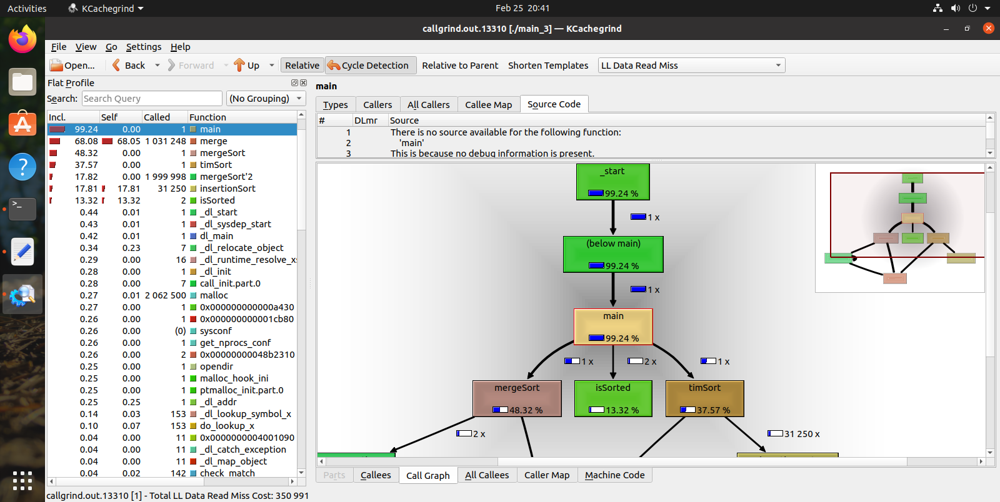
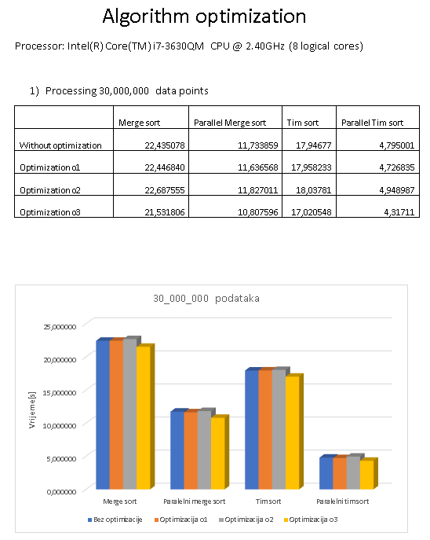
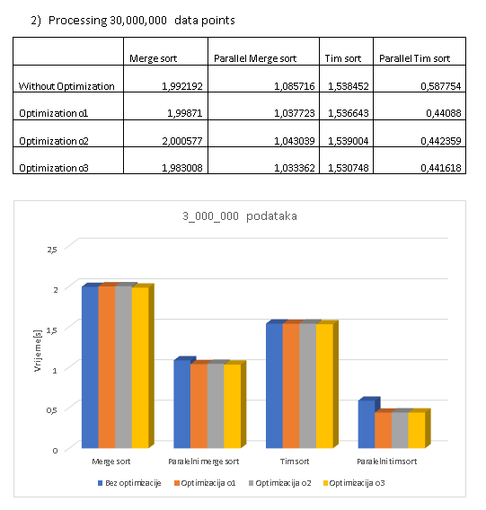

# Parallelizable Algorithm Optimization and Parallelization

## Project Motivation

This project focuses on implementing and optimizing the Merge Sort and Tim Sort algorithms, which are commonly used for sorting data. The goal is to analyze, compare, and document the performance improvements achieved through compiler optimizations and parallelization techniques.

## Merge Sort Optimization

- Measure the performance of the initial implementation of Merge Sort and identify any potential bottlenecks or areas for optimization.
- Apply compiler optimizations to enhance the efficiency of the algorithm, such as loop unrolling, vectorization, or inline expansion.
- Conduct performance measurements using appropriate tools to demonstrate the impact of the optimizations on the execution time of Merge Sort.
- Document the optimization techniques applied, along with the corresponding improvements in performance.

## Tim Sort Optimization

- Evaluate the performance of the initial implementation of Tim Sort and identify areas where optimization can be applied.
- Utilize compiler optimizations specific to Tim Sort, such as adaptive merging or run size analysis, to enhance its efficiency.
- Measure the performance of the optimized Tim Sort implementation and compare it with the initial version.
- Document the optimization techniques used and provide a quantitative analysis of the performance improvements.

## Parallelization of Sorting Algorithms

- Explore parallelization techniques for sorting algorithms, such as using multiple threads or task-based parallelism.
- Implement parallel versions of Merge Sort and Tim Sort, leveraging the available computing resources effectively.
- Measure the speedup achieved through parallelization and compare it with the sequential execution.
- Document the parallelization approach used, including the framework or custom solution employed.

## Combined Optimization and Parallelization

- Combine the optimization techniques and parallelization approaches for both Merge Sort and Tim Sort to achieve further speedup.
- Measure and document the performance improvements obtained through the combined optimization and parallelization efforts.
- Provide graphical representations or charts to illustrate the performance gains achieved by the optimized and parallelized algorithms.

## Unit Tests
Design and execute a set of unit tests to verify the correctness and accuracy of the optimized and parallelized sorting algorithms. Compare the results against known input data sets and ensure the outputs match the expected sorted order.

## Development Guidelines

Follow coding best practices, including clean code principles and proper naming conventions for variables, functions, classes, and methods.
Adhere to the conventions and standards of the chosen programming language.
Document the code and provide clear explanations of the optimizations and parallelization techniques applied.
Please refer to the specific programming language documentation and guidelines for implementation details.

Feel free to customize and adapt the provided information to match your project's requirements and programming language of choice.

